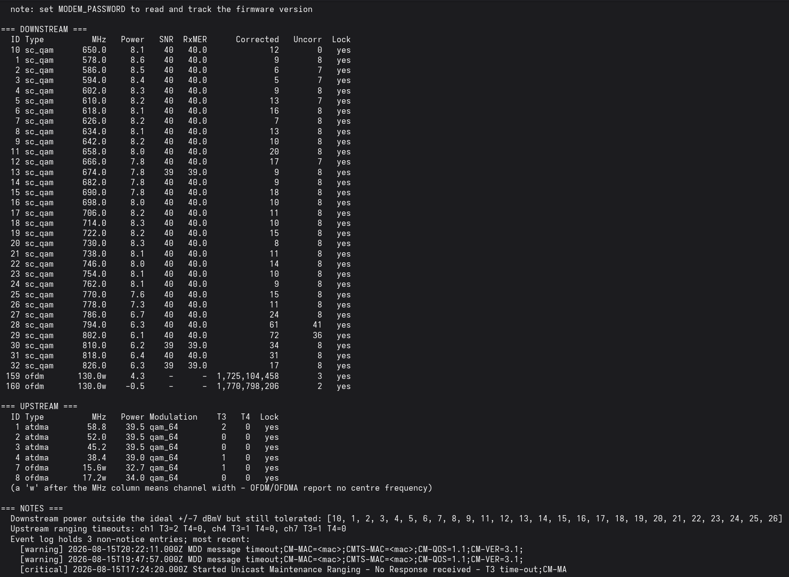
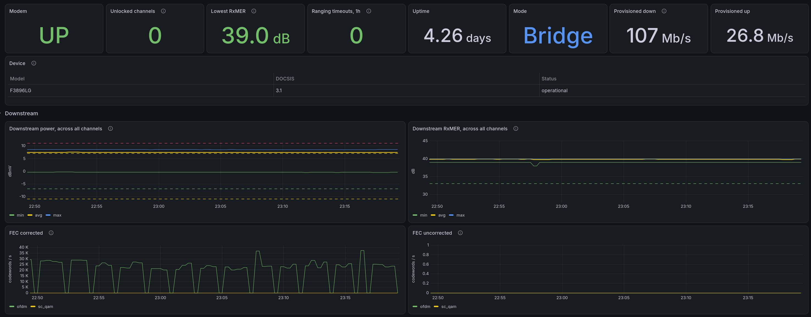
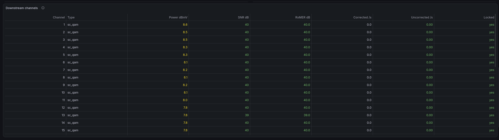
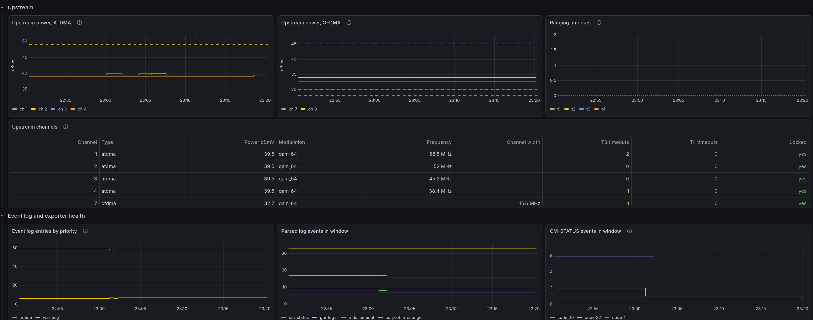
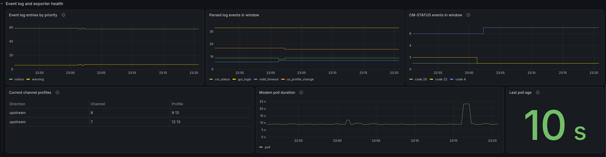
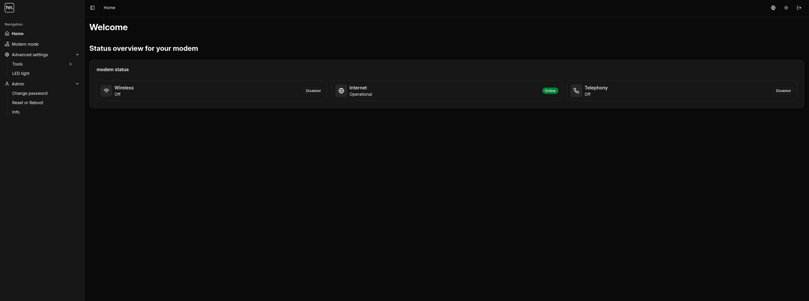

# Sagemcom F3896LG monitoring for Ziggo

Tools to read and monitor the Sagemcom F3896LG cable modem, the black "SmartWifi"
modem used on the Ziggo cable network, running LG-RDK firmware.

Two parts, each usable on its own.

- `modem.py` prints a signal summary in the terminal and writes `stats.json`.
- `exporter.py` is a Prometheus exporter, so you can graph it in Grafana and keep
  history.

**All of it works without the modem password.** Every signal endpoint answers
without logging in, so there's no credential to store or leak. Only the firmware
version sits behind the login, and even that is optional (see
[firmware version](#firmware-version)).

<p>
  &emsp;
  <picture>
    <source media="(prefers-color-scheme: dark)" srcset="docs/images/hn-logo.svg">
    
  </picture>
</p>

<sub>Hobby project, no ties to VodafoneZiggo or Hollandsnieuwe. The logos and the
modem picture belong to their owners.</sub>

## What it was built against


My F3896LG is Hollandsnieuwe-branded and it's the only one this has been tested
on, **not a Ziggo-branded one**. It should work there anyway. The ties project
(see credits) was built against Ziggo modems, and mine answers exactly like their
recorded test data. Same endpoints, same fields, same units, even the same event
log wording. Looks like a plain reskin. If you run this on a Ziggo modem, open an
issue and let me know either way.

It runs in **bridge mode** with my own router behind it, so these tools only read
what the modem exposes that way. Signal levels, error counters, the event log,
uptime and the provisioned rates. No router or wifi endpoints, those just report
"disabled". Bridge mode also drops the modem back to 192.168.100.1, which is why
that's the default address everywhere here.

<br clear="all">

## Screenshots

Terminal summary from `modem.py`:



Grafana, using the Prometheus exporter, from top to bottom:









For comparison, the modem's own web page, here in the Hollandsnieuwe skin:



## What you can see

Downstream and upstream power, SNR and RxMER, corrected and uncorrected error
counts, channel lock status, and the DOCSIS ranging timeouts (T3/T4) that show up
when the upstream is struggling. It also parses the event log for the things that
actually matter, like profile assignment changes, CM-STATUS events (NCP/PLC/MDD
failures and recoveries), reboots and ranging timeouts.

Values are checked against the ranges Ziggo publishes, not generic guesses.

| Measurement            | Good                | Tolerated      |
|------------------------|---------------------|----------------|
| Downstream power       | -7 to +7 dBmV       | down to +/-11  |
| Downstream SNR / RxMER | above 33 dB         |                |
| Upstream power (ATDMA) | 35 to 49 dBmV       | up to 51       |
| Upstream power (OFDMA) | 30 to 45 dBmV       |                |

OFDMA sits lower than ATDMA on purpose, since it's measured across a wider block
of spectrum. Normal, not a fault.

## Getting started

First check you can reach the modem.

```
curl -sk https://192.168.100.1/rest/v1/cablemodem/state_
```

JSON back with `"status":"operational"` in it and you're good. The `-k` is for
the modem's own certificate.

If it hangs, your router most likely has no route to the modem. Bridge mode puts
it outside your own LAN, so that route needs to exist before any of this works.
Connection refused instead means it's listening elsewhere, so note that address
for `MODEM_HOST`.

```
git clone https://github.com/hotsoupp/sagemcom-f3896lg-ziggo.git
cd sagemcom-f3896lg-ziggo
```

Then [Python](#python) if you want the terminal summary too, or
[Docker](#docker) if you only want the exporter.

## Python

Python 3.10 or newer and `requests`. No root, nothing to compile.

```
python3 -m venv .venv
source .venv/bin/activate
pip install -r requirements.txt
```

Your distribution's `python3-requests` works just as well.

### Terminal summary

```
python3 modem.py
```

Prints the downstream and upstream tables plus a notes section, and writes
`stats.json` next to the script. If your modem is elsewhere:

```
MODEM_HOST=https://192.168.178.1 python3 modem.py
```

### Prometheus exporter

```
python3 exporter.py
```

Listens on http://127.0.0.1:9105/metrics and polls the modem in the background,
so scrapes return instantly. `/healthz` only confirms that the exporter is
running. Use `modem_up` to check modem access.

| Variable               | Default                 | Meaning                     |
|------------------------|-------------------------|-----------------------------|
| `MODEM_HOST`           | `https://192.168.100.1` | Modem address               |
| `MODEM_EXPORTER_PORT`  | `9105`                  | Port to listen on           |
| `MODEM_EXPORTER_BIND`  | `127.0.0.1`             | Interface to bind           |
| `MODEM_INTERVAL`       | `60`                    | Seconds between modem polls |
| `MODEM_REQUEST_TIMEOUT` | `10`                   | Seconds allowed per request |
| `MODEM_REQUEST_RETRIES` | `3`                    | Attempts per request        |
| `MODEM_REQUEST_BACKOFF` | `1`                    | Initial retry backoff in seconds |

Retry backoff doubles for each retry and is capped at 4 seconds. A slow
endpoint can exceed `MODEM_INTERVAL`. The next poll starts once the current
poll finishes.

To run it as a service, first create the account it runs as. It only needs
read access to wherever you cloned the repo, nothing else, so grant that
without changing ownership. That way whoever set up the venv above, or runs
the occasional firmware.log update below, keeps owning their own files.

```
sudo useradd --system --no-create-home --shell /usr/sbin/nologin modem-exporter
sudo chmod -R o+rX /opt/sagemcom-f3896lg-ziggo
```

That chmod does not apply retroactively, run it again after a `git pull` or
after adding files the service needs to read.

The unit's `ProtectSystem=strict` makes the whole filesystem read-only to the
service, including that directory. That is fine, the exporter never writes
anything, it only reads `firmware.log`. The sample unit's `ExecStart` assumes
the venv from the [Python](#python) section above, at `.venv`. If you
installed the dependencies system-wide instead, change it to plain
`python3 /opt/sagemcom-f3896lg-ziggo/exporter.py`. Either way, edit the paths
in `systemd/modem-exporter.service` if you cloned somewhere other than
`/opt/sagemcom-f3896lg-ziggo`.

```
sudo cp systemd/modem-exporter.service /etc/systemd/system/
sudo systemctl daemon-reload
sudo systemctl enable --now modem-exporter
```

## Docker

Set `MODEM_HOST` in `docker-compose.yml` if your modem isn't on 192.168.100.1,
then:

```
docker compose up -d
curl -s http://127.0.0.1:9105/metrics | grep '^modem_up'
```

`modem_up 1` means it's reading the modem. `0` means the exporter is running but
can't see it, usually because the container has no route there. Add
`network_mode: host` to the service and drop the `ports` block.

The image runs unprivileged, holds no credentials, and 9105 is published to
127.0.0.1 only, so it stays on the machine. Update with
`git pull && docker compose up -d --build`.

## Prometheus and Grafana

Grafana talks to Prometheus, not to the exporter, so you need a Prometheus
scraping the job below. There's a `prometheus.yml` in the repo if you have none,
and `docker compose --profile prometheus up -d` runs one alongside.

```yaml
scrape_configs:
  - job_name: modem
    scrape_interval: 60s
    static_configs:
      - targets: ['localhost:9105']
```

There's also an `alerts.yml` with example rules for modem reachability,
uncorrectable errors, lost channel lock, T3/T4 ranging timeouts, optional
endpoint failures and a stalled exporter.
Point Prometheus at it with `rule_files: [alerts.yml]` if you want them, they
are not wired to an Alertmanager by this repo, that part is on you.

Then in Grafana, Dashboards, Import, upload `grafana-dashboard.json` and pick
your Prometheus as the data source.

The charts show min, average and max across channels rather than 32 lines, with
Ziggo's ranges as dashed lines, and upstream split into ATDMA and OFDMA since
their ranges differ. Under each is a table with every channel, coloured the same
way, for finding the one misbehaving.

## Firmware version

The one value that needs the modem password, and the only optional part here.
Skip it and everything still runs, `modem_info` just carries no
`software_version` label. To record it, run `modem.py` once with the password
set.

```
MODEM_PASSWORD='your-password' python3 modem.py
```

It reads the version, appends it with a date to `firmware.log`, and logs out
again cleanly. After that the exporter reads it from that file and never needs
the password. Worth rerunning now and then. Ziggo pushes firmware silently, and
it's handy to line an update up against the moment your line went bad.

The exporter only ever reads that file, it never logs in itself, so setting
`MODEM_PASSWORD` on the exporter does nothing. In Docker the file isn't in the
image either, so mount it if you want the version in there. `docker-compose.yml`
has the line ready to uncomment.

To keep the version current without remembering to run it yourself, put it on
a timer instead. A cron entry works, keep the password out of the crontab
itself:

```
# /etc/modem-exporter.env, mode 600, owned by whoever runs the cron job
MODEM_PASSWORD=your-password
```

```
# crontab -e
0 6 * * * . /etc/modem-exporter.env; MODEM_PASSWORD="$MODEM_PASSWORD" /opt/sagemcom-f3896lg-ziggo/.venv/bin/python3 /opt/sagemcom-f3896lg-ziggo/modem.py
```

This is a separate, occasional job, not part of the always-on exporter
service, so it is not in `systemd/modem-exporter.service`.

## Metrics

Full list in [docs/metrics.md](docs/metrics.md). One thing to know. The event log
metrics are gauges over the modem's rolling window, not lifetime counters, so
don't wrap them in `rate()`.

## Limitations

- Built and tested against one F3896LG in bridge mode on LG-RDK firmware. Other
  firmware builds may word event log messages differently.
- `stats.json` has the serial number and MAC addresses stripped out, including
  from event log messages, as a privacy default. Keep that in mind if you change
  what gets written.

## Credits

The event log parsing patterns for profile changes and reboots follow the
approach in [ties/sagemcom-f3896-py](https://github.com/ties/sagemcom-f3896-py),
a more mature exporter for the same modem that also ships a Grafana dashboard
(ID 20072). The differences here are that it needs no password, polls in the
background so scrapes never time out, adds the provisioned service flow rates,
and uses Ziggo's published thresholds. ties isn't actively maintaining that
project after switching away from Ziggo (see
[#85](https://github.com/ties/sagemcom-f3896-py/issues/85)), but it still works
and is worth a look.

Two panels here, the lowest RxMER and the ranging timeouts over the last hour,
are ideas taken from the
[Connect Box dashboard](https://grafana.com/grafana/dashboards/22707-connect-box/)
by mbugert, which does the same job for the Compal CH7465LG that Ziggo handed out
before this one.

Signal reference values come from the Vodafone & Ziggo community, in particular
[Waar vind ik de up- en downstreamwaarden van mijn modem?](https://community.ziggo.nl/t5/Tips-van-Ziggo/Waar-vind-ik-de-up-en-downstreamwaarden-van-mijn-modem/ba-p/695389)
and [Zijn mijn waardes modem goed? deel 2](https://community.ziggo.nl/t5/Internet/Zijn-mijn-waardes-modem-goed-deel-2/td-p/793493).
DOCSIS CM-STATUS event codes are from Cisco's DOCSIS 3.1 documentation.
